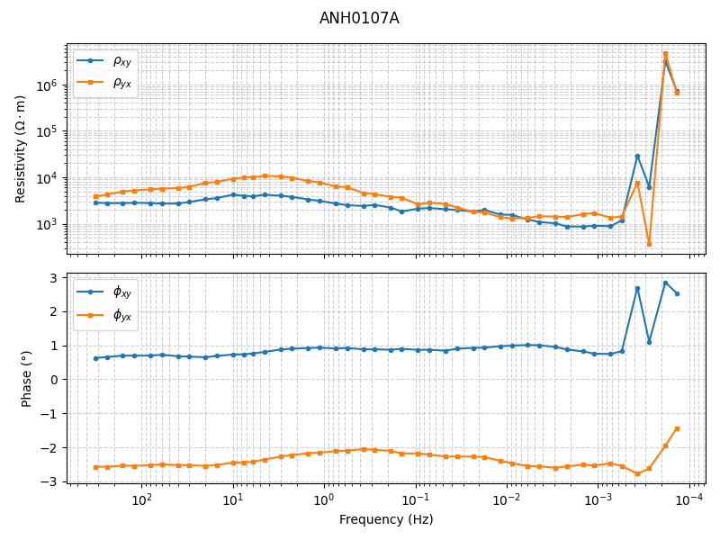
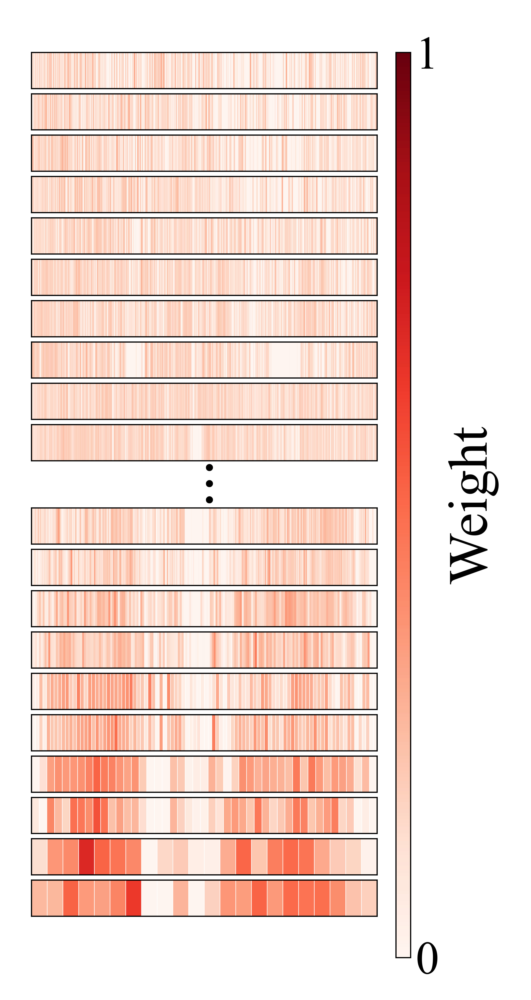
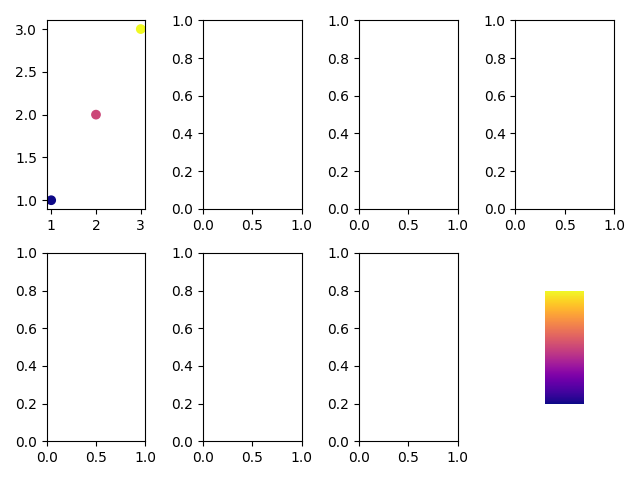

# FAW-Net: A Physics-Guided Frequency-Adaptive Weighting Network for Magnetotelluric Impedance Estimation

深度学习驱动的大地电磁（Magnetotelluric, MT）功率谱智能加权去噪框架。

本仓库实现了论文中的核心模型 **FreqAdaptWeighter（FAW-Net）**：对同一测站、同一频点下的多个功率谱段进行自适应加权，抑制噪声段、保留可靠段，从而得到更稳健的阻抗与视电阻率/相位响应。

---

## 方法概览

传统 Robust 估计或手工规则选谱依赖固定统计量，在强人文噪声、非平稳干扰下往往不够灵活。FAW-Net 将「谱段加权」建模为一个频率自适应的序列建模问题：

1. **物理特征编码**：从 7×7 功率谱矩阵中提取阻抗、倾子、自功率谱、相位张量等多物理量，构成谱段特征。
2. **频率内建模（CSA + FDC）**：
   - **Cross-Segment Attention（CSA）**：同一频点内谱段间自注意力，捕捉段间一致性；
   - **Frequency-conditioned Dynamic Conv1D（FDC）**：由频率生成卷积核，低频用更大感受野、高频保留细节。
3. **跨频率建模（CFA）**：基于趋肤深度 \(\delta \propto \sqrt{\rho/f}\) 构造物理偏置注意力，让相邻频率互相「作证」，识别局部异常。
4. **门控融合与权重输出**：FusionGate 自适应融合段级局部特征与频率级全局特征，经温度化 Softmax 输出每个频点各谱段的归一化权重。
5. **物理约束多任务损失**：
   - MSE 监督（相对目标阻抗响应）；
   - 对数频率域二阶连续性约束；
   - 权重极化/稀疏单边约束（防止 one-hot 崩塌）；
   - 因果性约束。

加权后的功率谱矩阵经最小二乘重新求阻抗，得到去噪后的 \(\rho_{xy}/\rho_{yx}\)、\(\phi_{xy}/\phi_{yx}\) 等响应。

## 示例结果

测站 **ANH0107A** 的视电阻率与相位响应：



对应频点上的谱段权重分布（模型对各功率谱段的信任程度，颜色越深权重越高）：



更完整的多分量响应对比：



---

## 仓库结构

```text
src_2_github/
├── model.py              # FreqAdaptWeighter 及各子模块（CSA / FDC / CFT / FusionGate）
├── loss.py               # 多任务物理约束损失
├── struct.py             # 功率谱矩阵、阻抗、相位张量等数据结构与计算
├── param.py              # 多参数特征提取与特征选择（30 维可裁剪）
├── t_calc.py             # PyTorch 版阻抗 / 视电阻率 / 相位计算
├── cdataset.py           # Dataset、特征筛选、训练/验证划分
├── trainer.py            # 训练循环、权重保存、粗糙度监控
├── denoise.py            # 推理与批量去噪入口
├── visualization.py      # 权重、阻抗、去噪前后对比等可视化
├── viewer.py             # PySide6 交互式结果查看器（可选）
├── main_run_train.py     # 训练示例入口
├── test_load_pkl.py      # 数据格式检查脚本
├── requirements.txt      # Python 依赖
├── best_model.pth        # 论文训练得到的最优模型权重
├── docs/assets/          # README 示例图
└── pkl/                  # 部分示例测站数据（非完整训练集）
```

---

## 数据与训练结果模型说明

本仓库**有意只公开部分测站的示例数据**，并附带**论文训练过程得到的最优模型权重** `best_model.pth`。原因如下：

1. **完整野外数据体量过大**  
   论文训练与评估使用了更大规模的实测 MT 时间序列衍生功率谱数据集；全部站点的 7×7 功率谱段文件体积很大，直接全部放入代码仓库并不合适，也会显著增加获取门槛。

2. **部分数据受采集与使用协议约束**  
   完整数据集中包含多期野外采集项目与合作单位提供的测站资料，其再分发需遵守相应数据使用约定。在获得完整公开许可之前，本仓库仅提供用于代码验证与结果复现演示的**代表性子集**。

3. **优先保证方法可验证、结果可对照**  
   `best_model.pth` 保存的是论文实验训练结束后得到的最终模型参数。读者无需重新训练即可在公开示例站点上复现推理流程：加载权重 → 谱段加权 → 重估阻抗 → 对比去噪前后视电阻率/相位曲线。这与论文中报告的指标对照路径一致，便于审稿人与后续研究独立核查。

4. **训练代码仍完整开放**  
   `main_run_train.py`、`cdataset.py`、`loss.py`、`trainer.py` 与模型实现一并公开。研究者可按下一节的数据格式，用自有或公开 MT 数据集自行训练与微调。

### 本仓库包含什么

| 内容                      | 状态             | 用途                   |
| ------------------------- | ---------------- | ---------------------- |
| 模型、损失、训练/推理代码 | 完整公开         | 复现方法与二次开发     |
| `best_model.pth`          | 论文训练最优权重 | 直接推理与结果对照     |
| `pkl/` 示例测站           | **部分子集**     | 流程验证、可视化与演示 |
| 完整训练/测试全集         | 未随仓库分发     | 见下方说明             |

### 如何获取或扩展数据

- **复现推理结果**：直接使用仓库内 `pkl/` 与 `best_model.pth` 即可。
- **自行训练**：按 [数据格式](#数据格式) 将自有测站整理为同结构 `.pkl`，放入 `pkl/` 目录后运行 `main_run_train.py`。
- **完整实验数据**：若因论文复现或对比实验需要完整数据集，请通过论文通讯作者邮箱联系（见文末），在符合数据使用条件的前提下协商获取。

> **说明**：公开示例站点已覆盖与论文相同的特征工程与加权推理路径；因训练集规模不同，用本仓库子集从零训练得到的模型精度**不能**直接等同于论文中的 `best_model.pth`。

---

## 环境依赖

- Python ≥ 3.10（开发环境为 3.12）
- 安装：

```bash
pip install -r requirements.txt
```

主要依赖：

```text
torch
numpy
matplotlib
scienceplots
tqdm
# 可选：交互式查看器
PySide6
pyqtgraph
```

> 说明：`torch` 请按本机 CUDA/CPU 环境选择官方安装方式；仓库内示例模型 `best_model.pth` 用 PyTorch 保存，`map_location="cpu"` 即可在无 GPU 环境加载。
>
> 若从完整研究工程中拆出本目录，部分脚本原先通过包内相对导入（`from .xxx import ...`）运行；将本目录作为包使用，或把相对导入改为同目录绝对导入即可。

---

## 数据格式

每个测站对应一个 `.pkl` 文件，内容为 `dict`：

| 字段     | 含义           | 形状 / 类型                                     |
| -------- | -------------- | ----------------------------------------------- |
| `target` | 目标响应       | `dict[float, array(4)]`：`(ρxy, φxy, ρyx, φyx)` |
| `matrix` | 各频点功率谱段 | `dict[float, Tensor(N, 7, 7)]`                  |
| `param`  | 各频点谱段特征 | `dict[float, array(N, F)]`，默认可到 30 维      |

其中 `N` 为该频点的谱段数（不同频点可以不等长，例如 500 / 100 / 20）。

可运行以下脚本快速检查：

```bash
python test_load_pkl.py
```

### 特征维度开关（默认实验配置）

完整 30 维特征由 `param.Params.to_features()` 生成，可按物理模块裁剪：

| 模块                                     | 维数 | 索引  |
| ---------------------------------------- | ---- | ----- |
| 阻抗张量 Zxx/Zyy/Zxy/Zyx（幅值+sin/cos） | 12   | 0–11  |
| 倾子 Tzx/Tzy                             | 6    | 12–17 |
| 功率谱密度 Ex/Ey/Hx/Hy                   | 4    | 18–21 |
| 相位张量角度 α/β                         | 4    | 22–25 |
| 相位张量主值 P11/P12/P21/P22             | 4    | 26–29 |

论文默认设置（与 `best_model.pth` 一致）：

```python
use_impedance=True
use_tipper=False
use_psd=True
use_phase_tensor_angles=False
use_phase_tensor_main=True
# → 实际输入 20 维
```

---

## 快速开始

### 1. 使用论文训练结果模型去噪

`best_model.pth` 为论文训练得到的最优权重，可直接在仓库示例站点上复现推理流程（无需重新训练）：

```python
from pathlib import Path
import torch

from model import FreqAdaptWeighter
from denoise import denoise_by_pkl
from visualization import (
    plot_before_after_rho_phi,
    plot_weights_heatmap,
    plot_weight_curve,
)

model = FreqAdaptWeighter(n_features=20)
ckpt = torch.load("best_model.pth", map_location="cpu")
model.load_state_dict(ckpt["model_state_dict"])

pkl = Path("pkl/ANH0203A.pkl")
psms, params, weights, single_psms = denoise_by_pkl(
    pkl=pkl,
    model=model,
    use_tipper=False,
    use_phase_tensor_angles=False,
)

plot_before_after_rho_phi(single_psms, psms, name=f"{pkl.stem} Denoised")
plot_weights_heatmap(weights, title=f"{pkl.stem} — Weight Heatmap")
plot_weight_curve(weights, title=f"{pkl.stem} — Weight vs Frequency")
```

### 2. 训练（代码流程演示）

参考 `main_run_train.py`。仓库内 `pkl/` 仅为部分示例站点，**完整复现论文训练请按上文说明准备全量数据**；下列配置与论文实验一致，便于理解训练管线：

````python

```python
from pathlib import Path
import torch
import torch.optim as optim
from torch.optim.lr_scheduler import CosineAnnealingLR

from cdataset import CustomDataset, create_feature_selector, split_dataset
from loss import Loss
from model import FreqAdaptWeighter
from trainer import Trainer

device = torch.device("cuda" if torch.cuda.is_available() else "cpu")
epochs = 10

pre_deal_feature = create_feature_selector(
    use_impedance=True,
    use_tipper=False,
    use_psd=True,
    use_phase_tensor_angles=False,
    use_phase_tensor_main=True,
)

dataset = CustomDataset(
    data_dir=Path("pkl"),
    max_num=100,
    device=device,
    pre_deal_feature=pre_deal_feature,
)
train_loader, val_loader = split_dataset(dataset, batch_size=4)

model = FreqAdaptWeighter(n_features=20).to(device)
criterion = Loss().to(device)
optimizer = optim.AdamW(model.parameters(), lr=3e-3, weight_decay=1e-4)
scheduler = CosineAnnealingLR(optimizer, T_max=epochs, eta_min=4e-5)

trainer = Trainer(
    model=model,
    criterion=criterion,
    optimizer=optimizer,
    device=device,
    scheduler=scheduler,
    save_dir=Path("checkpoints"),
)
trainer.run(train_loader=train_loader, epochs=epochs, val_loader=val_loader)
````

### 3. 交互式查看器

```bash
python viewer.py
```

可在 GUI 中浏览测站、频点、权重散点与去噪前后 \(\rho/\phi\) 曲线。

---

## 模型超参数

`FreqAdaptWeighter` 默认配置（经 Optuna 搜索）：

| 参数               | 默认值 | 说明             |
| ------------------ | ------ | ---------------- |
| `n_features`       | 20     | 输入特征维度     |
| `d_model`          | 64     | 隐层维度         |
| `n_heads`          | 8      | 注意力头数       |
| `n_freq_neighbors` | 4      | CFA 每频点邻居数 |
| `dropout`          | 0.07   | Dropout          |

损失默认权重：

| 系数            | 默认值 | 对应项                |
| --------------- | ------ | --------------------- |
| `lambda_sup`    | 1.0    | MSE 监督              |
| `lambda_smooth` | 0.01   | 二阶连续性            |
| `lambda_polar`  | 0.5    | 权重极化约束          |
| `lambda_kk`     | 0.1    | Kramers–Kronig 因果性 |

---

## 可视化能力

`visualization.py` 提供：

- `plot_single_freq_weights`：单频点权重分布
- `plot_single_freq_impedance`：单频点阻抗幅值/相位
- `plot_single_freq_features`：按权重排序的输入特征
- `plot_weights_heatmap` / `plot_weight_curve`：全频点权重热图与曲线
- `plot_before_after_rho_phi`：去噪前后 \(\rho/\phi\) 对比
- `plot_denoise_dashboard`：单频点或全频点综合面板

---

## Data Availability

Due to the large volume of field MT records and restrictions associated with multi-campaign field acquisition, the complete training corpus is not redistributed with this repository. A representative subset of station-level spectral files (`pkl/`) is provided for code verification, together with the final trained model parameters (`best_model.pth`) obtained in the paper experiments. Researchers may retrain the model on their own datasets following the documented format, or contact the corresponding author for access under applicable data-use terms.
