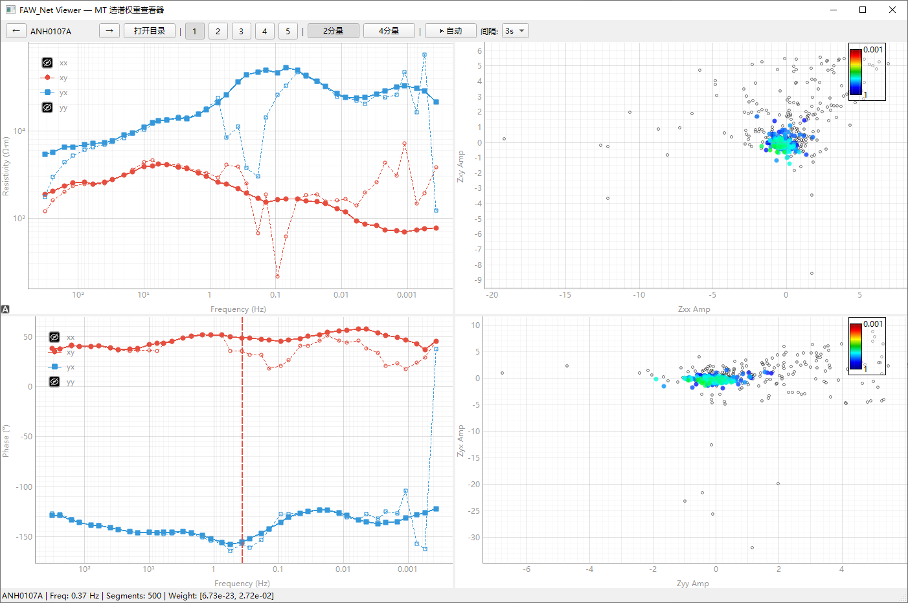

# FAW-Net: A Physics-Guided Frequency-Adaptive Weighting Network for Magnetotelluric Impedance Estimation

Deep learning framework for intelligent spectral-segment weighting and processing of magnetotelluric (MT) data.

This repository implements **FreqAdaptWeighter (FAW-Net)** from the paper: it adaptively re-weights multiple power-spectrum segments at each station and frequency, suppressing contaminated segments while retaining reliable ones, and yields more stable impedance and apparent-resistivity / phase responses.

---

## Method Overview

Conventional robust estimators or rule-based segment selection rely on fixed statistics and can be inflexible under strong anthropogenic noise and non-stationary interference. FAW-Net formulates spectral-segment weighting as a frequency-adaptive sequence modeling problem:

1. **Physical feature encoding**: extract impedance, tipper, auto-power spectra, phase tensor, and related quantities from the 7×7 power-spectrum matrix as segment features.
2. **Intra-frequency modeling (CSA + FDC)**:
   - **Cross-Segment Attention (CSA)**: self-attention among segments at the same frequency to capture inter-segment consistency;
   - **Frequency-conditioned Dynamic Conv1D (FDC)**: convolution kernels generated from frequency—larger receptive fields at low frequencies, finer detail at high frequencies.
3. **Cross-frequency modeling (CFA)**: physics-biased attention based on skin depth $\delta \propto \sqrt{\rho/f}$, so neighboring frequencies can mutually corroborate responses and identify local anomalies.
4. **Gated fusion and weight output**: FusionGate adaptively fuses segment-level local features with frequency-level global features; a temperature-scaled Softmax produces normalized segment weights at each frequency.
5. **Physics-constrained multi-task loss**:
   - MSE supervision against target impedance responses;
   - second-order continuity in the log-frequency domain;
   - one-sided polarization / sparsity constraint on weights (prevents one-hot collapse);
   - causality (Kramers–Kronig) constraint.

The weighted power-spectrum matrix is then re-inverted by least squares to obtain processed $\rho_{xy}/\rho_{yx}$ and $\phi_{xy}/\phi_{yx}$ responses.

## Example

Interactive viewer (`viewer.py`): processed-vs-raw $\rho/\phi$ curves on the left, and spectral-segment weight scatter at the selected frequency on the right:



---

## Repository Layout

```text
FAW-Net/
├── model.py              # FreqAdaptWeighter and submodules (CSA / FDC / CFT / FusionGate)
├── loss.py               # Multi-task physics-constrained loss
├── struct.py             # Power-spectrum matrix, impedance, phase tensor, etc.
├── param.py              # Multi-parameter feature extraction / selection (up to 30-D)
├── t_calc.py             # PyTorch impedance / resistivity / phase calculations
├── cdataset.py           # Dataset, feature selection, train/val split
├── trainer.py            # Training loop, weight saving, roughness monitoring
├── denoise.py            # Inference and batch processing entry points
├── visualization.py      # Weight, impedance, and before/after plots
├── viewer.py             # Optional PySide6 interactive viewer
├── main_run_train.py     # Training example entry
├── test_load_pkl.py      # Data-format check script
├── requirements.txt      # Python dependencies
├── best_model.pth        # Final model parameters from the paper experiments
├── docs/assets/          # README figures
└── pkl/                  # Sample station data (subset of the full training corpus)
```

---

## Data and Trained Model

This repository **intentionally releases only a subset of station examples**, together with the **final trained model parameters** `best_model.pth` from the paper. Reasons:

1. **Full field data are too large**  
   Training and evaluation used a larger corpus of field MT time-series–derived power-spectrum files. Bundling every 7×7 spectral-segment file in a code repository is impractical and raises the barrier to access.

2. **Some data are subject to acquisition and use agreements**  
   The complete corpus includes multi-campaign field records and partner-provided stations whose redistribution must follow the corresponding data-use terms. Until full public release is cleared, this repository only provides a **representative subset** for code verification and demonstration.

3. **Prioritize method verification and result comparison**  
   `best_model.pth` stores the final parameters obtained after training in the paper experiments. Readers can reproduce the inference pipeline on the public sample stations without retraining: load weights → re-weight spectral segments → re-estimate impedance → compare before/after apparent-resistivity and phase curves. This matches the evaluation path reported in the paper and facilitates independent review.

4. **Training code remains fully open**  
   `main_run_train.py`, `cdataset.py`, `loss.py`, `trainer.py`, and the model implementation are released. Researchers can train or fine-tune on their own or public MT datasets following the data format below.

### What is included

| Content | Status | Purpose |
|---------|--------|---------|
| Model, loss, train/inference code | Fully open | Reproduction and secondary development |
| `best_model.pth` | Final trained parameters | Direct inference and comparison |
| `pkl/` sample stations | **Subset** | Pipeline checks, visualization, demos |
| Full train/test corpus | Not redistributed | See notes below |

### How to obtain or extend data

- **Reproduce inference**: use the in-repo `pkl/` samples and `best_model.pth`.
- **Train yourself**: convert your stations to the documented `.pkl` format, place them under `pkl/`, and run `main_run_train.py`.
- **Full experimental data**: for paper reproduction or comparison, contact the corresponding author (see below) under applicable data-use terms.

> **Note**: the public sample stations exercise the same feature engineering and weighting-inference path as the paper. Because the training-set scale differs, a model trained from scratch only on this subset **cannot** be expected to match `best_model.pth`.

---

## Installation

- Python ≥ 3.10 (developed with 3.12)

```bash
pip install -r requirements.txt
```

Main dependencies:

```text
torch
numpy
matplotlib
scienceplots
tqdm
# optional interactive viewer
PySide6
pyqtgraph
```

> Install `torch` according to your CUDA/CPU setup. `best_model.pth` is a PyTorch checkpoint and can be loaded with `map_location="cpu"` on machines without a GPU.
>
> Some scripts were originally written with package-relative imports (`from .xxx import ...`). Use this directory as a package, or switch to same-directory absolute imports.

---

## Data Format

Each station is one `.pkl` file containing a `dict`:

| Field | Meaning | Shape / type |
|-------|---------|--------------|
| `target` | Target response | `dict[float, array(4)]`: `(ρxy, φxy, ρyx, φyx)` |
| `matrix` | Spectral segments per frequency | `dict[float, Tensor(N, 7, 7)]` |
| `param` | Segment features per frequency | `dict[float, array(N, F)]`, up to 30-D |

`N` is the number of segments at that frequency (may differ across frequencies, e.g. 500 / 100 / 20).

Quick check:

```bash
python test_load_pkl.py
```

### Feature switches (default experiment setting)

The full 30-D features are built by `param.Params.to_features()` and can be subset by physical module:

| Module | Dim | Indices |
|--------|-----|---------|
| Impedance Zxx/Zyy/Zxy/Zyx (amp + sin/cos) | 12 | 0–11 |
| Tipper Tzx/Tzy | 6 | 12–17 |
| Power spectral density Ex/Ey/Hx/Hy | 4 | 18–21 |
| Phase tensor angles α/β | 4 | 22–25 |
| Phase tensor elements P11/P12/P21/P22 | 4 | 26–29 |

Default settings (consistent with `best_model.pth`):

```python
use_impedance=True
use_tipper=False
use_psd=True
use_phase_tensor_angles=False
use_phase_tensor_main=True
# → 20-D input
```

---

## Quick Start

### 1. Inference with the trained model

`best_model.pth` is the final trained model from the paper and can be applied to the sample stations without retraining:

```python
from pathlib import Path
import torch

from model import FreqAdaptWeighter
from denoise import denoise_by_pkl
from visualization import (
    plot_before_after_rho_phi,
    plot_weights_heatmap,
    plot_weight_curve,
)

model = FreqAdaptWeighter(n_features=20)
ckpt = torch.load("best_model.pth", map_location="cpu")
model.load_state_dict(ckpt["model_state_dict"])

pkl = Path("pkl/ANH0203A.pkl")
psms, params, weights, single_psms = denoise_by_pkl(
    pkl=pkl,
    model=model,
    use_tipper=False,
    use_phase_tensor_angles=False,
)

plot_before_after_rho_phi(single_psms, psms, name=f"{pkl.stem} Processed")
plot_weights_heatmap(weights, title=f"{pkl.stem} — Weight Heatmap")
plot_weight_curve(weights, title=f"{pkl.stem} — Weight vs Frequency")
```

### 2. Training (pipeline demo)

See `main_run_train.py`. The bundled `pkl/` files are a **subset**; prepare the full corpus as described above to reproduce paper training. The configuration below matches the paper experiments:

```python
from pathlib import Path
import torch
import torch.optim as optim
from torch.optim.lr_scheduler import CosineAnnealingLR

from cdataset import CustomDataset, create_feature_selector, split_dataset
from loss import Loss
from model import FreqAdaptWeighter
from trainer import Trainer

device = torch.device("cuda" if torch.cuda.is_available() else "cpu")
epochs = 10

pre_deal_feature = create_feature_selector(
    use_impedance=True,
    use_tipper=False,
    use_psd=True,
    use_phase_tensor_angles=False,
    use_phase_tensor_main=True,
)

dataset = CustomDataset(
    data_dir=Path("pkl"),
    max_num=100,
    device=device,
    pre_deal_feature=pre_deal_feature,
)
train_loader, val_loader = split_dataset(dataset, batch_size=4)

model = FreqAdaptWeighter(n_features=20).to(device)
criterion = Loss().to(device)
optimizer = optim.AdamW(model.parameters(), lr=3e-3, weight_decay=1e-4)
scheduler = CosineAnnealingLR(optimizer, T_max=epochs, eta_min=4e-5)

trainer = Trainer(
    model=model,
    criterion=criterion,
    optimizer=optimizer,
    device=device,
    scheduler=scheduler,
    save_dir=Path("checkpoints"),
)
trainer.run(train_loader=train_loader, epochs=epochs, val_loader=val_loader)
```

### 3. Interactive viewer

```bash
python viewer.py
```

Browse stations and frequencies, inspect weight scatter plots, and compare raw vs processed $\rho/\phi$ curves in the GUI.

---

## Model Hyperparameters

Default `FreqAdaptWeighter` configuration (via Optuna search):

| Parameter | Default | Description |
|-----------|---------|-------------|
| `n_features` | 20 | Input feature dimension |
| `d_model` | 64 | Hidden dimension |
| `n_heads` | 8 | Attention heads |
| `n_freq_neighbors` | 4 | CFA neighbors per frequency |
| `dropout` | 0.07 | Dropout rate |

Default loss weights:

| Coefficient | Default | Term |
|-------------|---------|------|
| `lambda_sup` | 1.0 | MSE supervision |
| `lambda_smooth` | 0.01 | Second-order continuity |
| `lambda_polar` | 0.5 | Weight polarization constraint |
| `lambda_kk` | 0.1 | Kramers–Kronig causality |

---

## Visualization

`visualization.py` provides:

- `plot_single_freq_weights`: weight distribution at a single frequency
- `plot_single_freq_impedance`: impedance amplitude / phase at a single frequency
- `plot_single_freq_features`: input features sorted by weight
- `plot_weights_heatmap` / `plot_weight_curve`: weight heatmap and curve over all frequencies
- `plot_before_after_rho_phi`: raw vs processed $\rho/\phi$
- `plot_denoise_dashboard`: single-frequency or all-frequency dashboard

---

## Data Availability

Due to the large volume of field MT records and restrictions associated with multi-campaign field acquisition, the complete training corpus is not redistributed with this repository. A representative subset of station-level spectral files (`pkl/`) is provided for code verification, together with the final trained model parameters (`best_model.pth`) obtained in the paper experiments. Researchers may retrain the model on their own datasets following the documented format, or contact the corresponding author for access under applicable data-use terms.

---

## Citation

If this code is useful for your research, please cite the paper (update fields as needed after publication):

```bibtex
@article{wang202xfawnet,
  title   = {FAW-Net: A Physics-Guided Frequency-Adaptive Weighting Network for Magnetotelluric Impedance Estimation},
  author  = {Wang, Peijie and Coauthors},
  journal = {IEEE Transactions on Geoscience and Remote Sensing},
  year    = {202X},
  note    = {Code: https://github.com/TySpark/FAW-Net}
}
```

---

## Acknowledgments

- Phase tensor calculations follow Caldwell, T. G., et al. (2004).
- Thanks to colleagues involved in field acquisition and preprocessing for the MT time series and power-spectrum data.

---

## License

This repository is released under the MIT License (see `LICENSE`).

---

## Contact

Wang Peijie  
Key Laboratory of Exploration Technologies for Oil and Gas Resources  
Yangtze University, Wuhan 430100, China  
Email: wangpj@yangtzeu.edu.cn

Please open a GitHub Issue or email the corresponding author for questions and collaboration.
